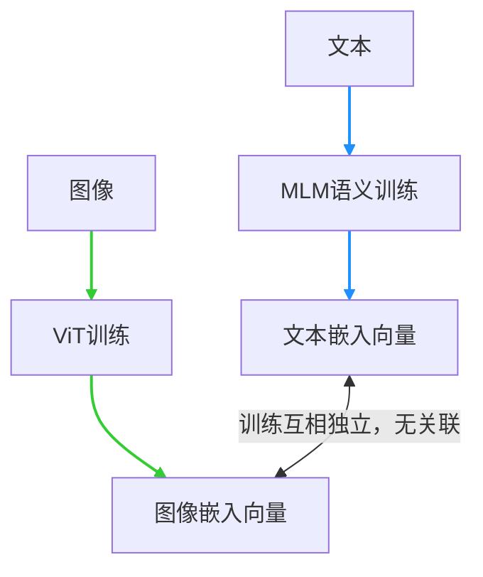
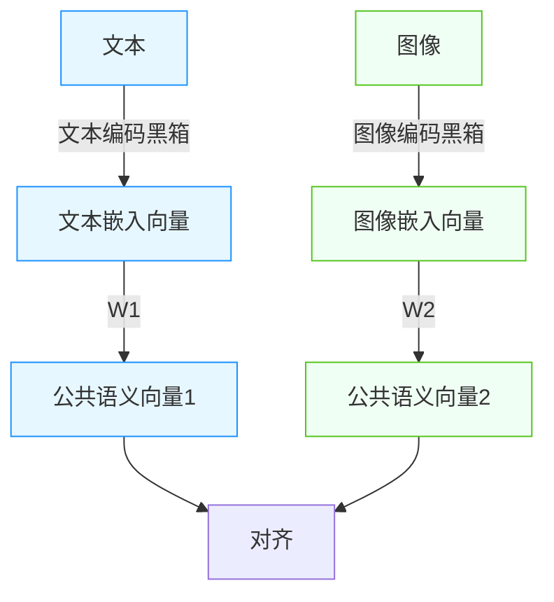

计算机的人机程度经常能刷新我们的下限。实际上，计算机就是人机概念本身（^^

必须时刻牢记的是，计算机只能操作数字。如果我们想造一个很高级的人机，那么我们必须清晰认识到下面的矛盾：
	生活在真实世界的人类，有很多的感官信号互相交融，补充。
	计算机只能操作数字。所有的不同形式的媒介信息，以不同的组合形式，一致地表现为数字。

我们又想要保留多感官的信息，又面临每种信息表现形式、结构不一样的问题。这个就像一堆人各说各的语言，在各自的宇宙中，根本无法交流。

既然如此，就开发出一种新的统一语言。在计算机中，其实指的就是向量。
>向量：用多个数字表示信息的**泛用方案**
>一个数字不够表示信息，既然如此，就用多个数字组成序列。很自然地想到向量这一数学对象。

训练一个将原始信息编码为向量的模型，能够让计算机通过分析结果向量之间的关系，得到原始信息之间的关系。这是一个**嵌入模型**。
>嵌入模型：将信息投射到可处理的固定维度向量。将语义塑造为计算机可理解的空间。
>形象地说，就是将信息转换成一个坐标，计算机处理坐标的几何关系。
>在这篇文章中，**嵌入**这个词很常用。字面意义上，就是在**语义的宇宙中固定下自己的位置**，请记住。

恭喜你！你将原本可以看懂的文字、图像，直接变成了一坨看不懂的数字！变成谜语人了已经。
![[ad6f7c3a9b3adeb087b4291963f12a18.gif|217]](./img/13/ad6f7c3a9b3adeb087b4291963f12a18.gif)
人类先不管，文字生成的向量，和图片生成的向量，它们两种之间也互相对不上。这下计算机也看不懂。
### 快速过一遍嵌入模型的知识点：
- 文本嵌入模型通过**MLM训练任务**，得到了融合上下文信息的能力；
> MLM (Masked Language Model)：文段遮住几个词，要求模型去输出原始文段。

- 图片嵌入模型训练了**ViT**（下图），得到的是视觉的语义。
![[93db8776297bcfd34b454d2f17905e7f.png|632]](./img/13/93db8776297bcfd34b454d2f17905e7f.png)
> 图片切块、投影，加上位置信息，然后类似文本的token一样送入Transformer提纯，最后从Transformer的输出（取平均或者取”CLS“）得到嵌入。
> 图中，嵌入向量过了MLP头去分类。这个跟理发推子一样，是附加的，实际使用时去掉它。

二者都是在自己的小宇宙中达到了**自洽**，却从来没有考虑过对方，满脑子都是自己。俩谜语人属于是。

## 多模态的现实
### 设定1：多模态信息，共性为使用数字表示，个性体现于以下四点
- 信息格式不同
- 时间和空间结构不同
- 语义粒度不同
- 噪声来源不同。
图片有大量的成块像素，并且在几何结构上具有大量信息量；音频的采样数据不是乱来的，它具有频域特征；文本咱就不说了，老祖宗的智慧，给老资历桂霞了。

### 设定2：多模态信息交互是好的。
但是我说这是好的，多模态有很多的用处。
- 多模态系统的典型应用：图文检索、图片问答、视频理解、语音助手、自动驾驶、医学影像辅助诊断。

### 设定3：一般来说，嵌入模型独立训练。谜语人沉浸在自己的世界里无法自拔了
这一点我们刚才讲过。是在哪里讲的？
我们找来一堆图片和对应的文本，比如一只猫的图片，对应文本就是“一只猫”。
这个时候，图片输出的向量，和文本输出的向量之间，就像是在两个不同的宇宙——文本宇宙和图像宇宙——关系可以说是完全随机的。没有任何理由能够让它们之间具有直接联系。

### 设计1：多模态共享的**嵌入宇宙**
给他们接一个稍简单的前馈网络，输出固定维度的向量。我们在这里要求，一个文本-图像对，输出的两个公共向量是对齐的。常用的方法是让余弦相似度去接近1。

当然，你也可以接稍复杂的Transformer。见下图的Connector。
![[Pasted image 20260507181010.png|358]](./img/13/Pastedimage20260507181010.png)
通过设计Loss函数可以达成这一引导目的。这就是**对比学习（Contrastive Learning）**
训练的时候，依旧冻结我们挪过来用的**原材料模型**，训练我们接的Connector的权重。

### 设计2：Loss
神经网络的训练本质上是在约束条件下的优化问题，大多采用梯度下降的优化方法。这里，我们采用设计Loss的形式让模型达成我们的对齐需求，并尝试最小化它。设计如下：
完整的损失函数由**图像→文本**和**文本→图像**两个方向的交叉熵损失组成，取平均值作为最终损失： $$ \mathcal{L} = \frac{1}{2} \left( \mathcal{L}_{I \rightarrow T} + \mathcal{L}_{T \rightarrow I} \right) $$ 其中：
1. 图像→文本损失： $$ \mathcal{L}_{I \rightarrow T} = -\frac{1}{N} \sum_{i=1}^{N} \log \frac{\exp\left( <I_i, T_i> / \tau \right)}{\sum_{j=1}^{N} \exp\left( <I_i, T_j> / \tau \right)} $$
2. 文本→图像损失： $$ \mathcal{L}_{T \rightarrow I} = -\frac{1}{N} \sum_{i=1}^{N} \log \frac{\exp\left( <I_i, T_i> / \tau \right)}{\sum_{j=1}^{N} \exp\left( <I_j, T_i> / \tau \right)} $$
不要怕上面的公式，这是典型的交叉熵loss设计，可以观察发现，**对应的图文向量相似度越高，不对应的图文向量相似度越低，loss越小。**
- $N$：批次大小（batch size）
- $<I, T>$：图像嵌入与文本嵌入的**余弦相似度** 
- $\tau$：温度系数（temperature），用于缩放相似度分布，论文中作为可学习参数优化 
- $I_i$：第$i$个图像的归一化特征向量 
- $T_i$：第$i$个文本的归一化特征向量

通过**设计2**，理想状态下我们能得到以下图中的产物：
![[4b470a933eeaf76425052a9b6c705fc4.png]](./img/13/4b470a933eeaf76425052a9b6c705fc4.png)
> 1:对比学习 预学习（成品模型。做到了图文对应。）
> 2:创建（图片）数据集的分类（“A photo of a sth.”）
> 3:用于**无需预习样本**的预测任务。（因为TextEncoder和ImageEncoder都已初步具备**对世间万物的语义理解**。相信预训练的数据集。）

## 发明项目：CLIP
发明人：OpenAI   发明项目：CLIP
CLIP（Contrastive Language-Image Pre-training）（对比语言 - 图像预训练）是OpenAI提出的多模态预训练模型架构。

它确保图片和文字嵌入模型的对齐化。让两个谜语人之间的电波对上，让它们用自己的共同语言去交流。
原始论文中，文本和图像嵌入模型是从0开始训练的，文本采用简单的transformer，图像采用ViT。
一般轻量一点的话，我们拿来现成的文本嵌入模型和图像嵌入模型，冻结它们的权重，不敢动它们（最多微调）。我们训练的就是比较简单的权重，一个“**头**”。

### 思考1：优化设计
**上面的loss公式，有其它设计方案吗？**
- 提示：分析，如果我们极致优化loss到了最低值，那么此时**不对应的图文**向量会倾向于呈现什么特征？
### 思考2：新建设计
自建一个轻量的静音视频-音频的对齐网络。或者你能够想到的任何对齐网络。
- 提示：找一些能用的嵌入模型。当然，也可以参考现有方案，设计嵌入模型。
- 提示：你也完全可以想出别的对齐任务。对齐的模态数也可以不止两个！
### 思考3：（可选）新建设计
嵌入模型可以作为一种**先验**信息提供器。训练累死电脑。
真实世界中这么多信息，人类也做了这么多工作。
跳出多模态的思维去思考，我们可以利用哪些”先验信息“？
- 提示：**老祖宗的智慧。**

## 不止图文对应：多模态模型
我们得到了**统一表述**、**统一口径**的信息表示。能做的，肯定不止匹配这么简单。

我认为的人工智能光谱：符号主义与连结主义之争（忽略行为主义）。
### 1、偏向符号主义：
自图片隐向量生成文本描述，然后通过提示词的构造，送入文本大语言模型
>其实这不是经典的符号主义——使用形式化语言和符号去推理。当然它已经被AI的历史彻底抛弃了。
### 2、偏向连结主义：
主张在语义空间内直接解决问题，更“原生态”。比如交叉注意力，文本和Q矩阵结合，图像和K矩阵结合，等等等等……

![[Pasted image 20260507180721.png]](./img/13/Pastedimage20260507180721.png)

>左图：视为公共语言，图片embeddings和文本embeddings拼成一个序列。
>右图：接近信息本质：将图片的embedding注入原始的文本Transformer的注意力模块中的K或V

历史上看，连结主义经受了相当长的历史考验。而符号主义以高成本、高维护难度、多义性处理难、泛化极其有限等各种缺点逐渐退场。
基于空间建模的高维向量“token”，属于**具有连结主义底色**的改良符号主义。

## 总结
3个设定，2个设计，2个思考。
思考过程中，建议拿笔乱写乱画。