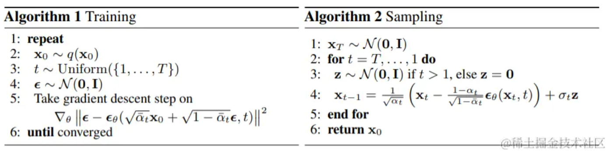
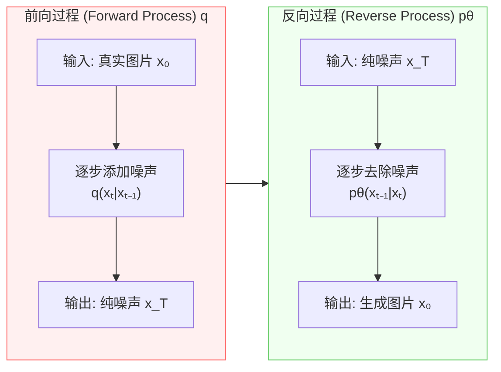
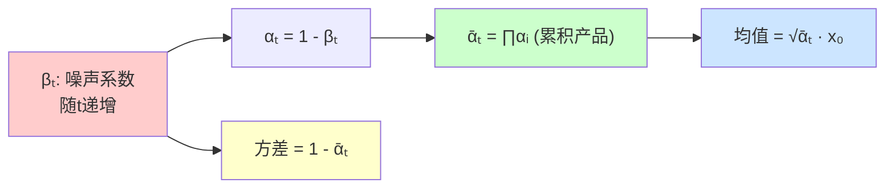
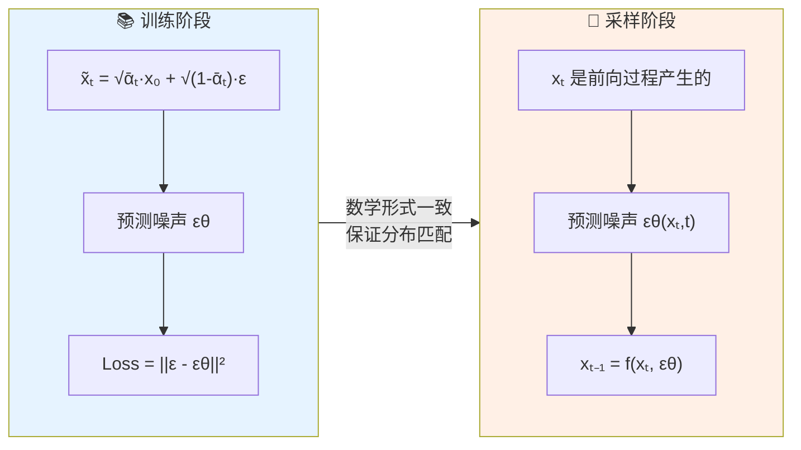
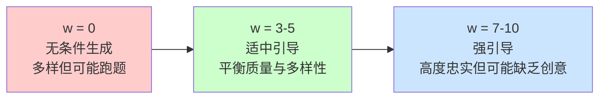
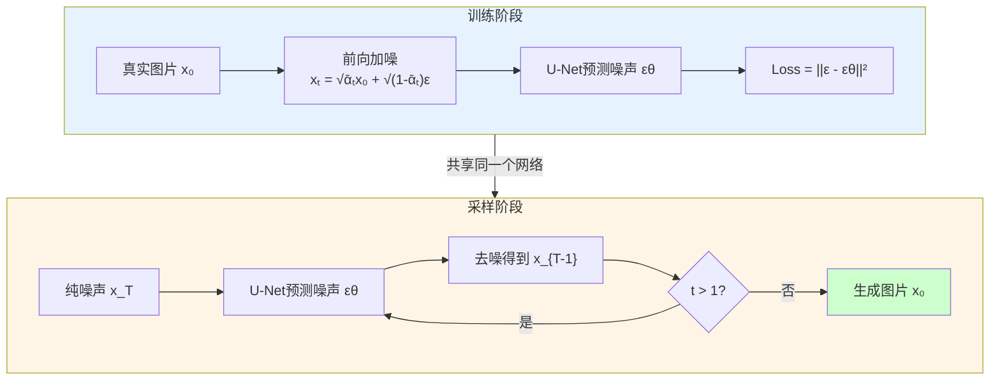

# Diffusion扩散模型：AI是怎么把东西生成出来的？

> **摘要**：Diffusion模型（扩散模型）是近年来深度学习领域最重要的突破之一，它在图像生成、视频生成、多模态生成等领域展现出了惊人的能力。本文将从概念入手，通过生动的例子和详细的数学推导，带你全面理解Diffusion模型的工作原理、训练机制以及前沿应用。

---

## 一、🚀 Diffusion模型概念速览

### 1.1 什么是Diffusion模型？

Diffusion，中文译为"扩散模型"，是一种基于概率论的深度生成模型。其核心思想源自物理学中的**扩散过程**——就像一滴墨水在水中逐渐扩散，最终均匀分布在整个容器中。Diffusion模型正是模拟了这个过程的"逆过程"：从混沌无序的噪声中，逐步恢复出有序、清晰的数据（如图片、文本、语音等）。

**Diffusion扩散模型的核心思路可以概括为"先破坏，后重建"**：

- **破坏阶段（前向扩散）**：将真实数据逐步添加噪声，最终变成纯噪声
- **重建阶段（反向去噪）**：从纯噪声出发，逐步去除噪声，恢复出真实数据

这种看似"多此一举"的设计实际上蕴含着深刻的数学智慧：通过学习如何"逆转"一个已知且可控的噪声过程，模型获得了强大的生成能力。

### 1.2 Diffusion是一种隐式自回归（Implicit Autoregressive）

> 💡 **关键洞察**：Diffusion模型的生成过程本质上是一种**隐式自回归（Implicit Autoregressive）**过程。

Diffusion是它是**逐步、多轮次的生成**：
![[一直更可爱的小猫咪~]](./img/images/2.png)

> **为什么这样设计？** 虽然Diffusion需要多步生成，但它解决了GAN训练不稳定、VAE生成模糊的核心问题。而且通过DDIM等技术，可以将多步压缩到10-50步，实际应用完全可以接受。

### 1.2 用生成一只"猫"来理解Diffusion模型

让我们通过一个具体的例子——生成一张猫的图片——来理解Diffusion模型的工作流程：

![[一只可爱的小猫咪~]](./img/images/1.png)

**流程详解**：

| 阶段 | 过程 | 目标猫图片的状态变化 |
|:---:|:---:|:---|
| **前向过程** | 逐步加噪 | 从清晰的猫 → 逐渐模糊 → 最终变成纯噪声 |
| **反向过程** | 逐步去噪 | 从纯噪声 → 逐渐清晰 → 最终生成清晰的猫 |

> **为什么模型能学会"去噪"？** 关键在于：前向过程的每一步我们都精确知道噪声是如何添加的（数学公式已知），因此在训练时，我们可以精确控制任意时间步 $t$ 的输入 $x_t$，然后让模型学习预测被添加的噪声 $\epsilon$。这样，当模型学会了这个逆过程后，给定任意带噪图片，它都能"猜出"原始图片的模样。

一个神秘的mc小视频演示

```video
//player.bilibili.com/player.html?isOutside=true&aid=114293995476145&bvid=BV1VvRkYHEqz&cid=29275194323&p=1
```
作为MC建筑党我真的感觉AI很厉害！
---

## 二、🔬 Diffusion模型神秘的原理
用Diffusion模型的图像生成来讲把

影像生成共同的目标是什么？
![[一只可爱小猫咪和一只诡异的小猫咪]](./img/images/956e845d3823d6f9739338bc22790432.jpg)



用DDPM来介绍一下
### 2.1 核心只有两个

Diffusion模型的核心数学框架可以形式化为两个马尔可夫链[^1]：



### 2.2 前向扩散过程详解（Forward Process）

前向过程 $q(x_{1:T}|x_0)$ 是**不可学**的，它负责将真实数据 $x_0$ 逐步转换为噪声。

#### 2.2.1 单步扩散公式

每一步的条件概率分布定义为：

$$q(x_t | x_{t-1}) = \mathcal{N}\left(x_t; \sqrt{1 - \beta_t} \cdot x_{t-1}, \beta_t \mathbf{I}\right)$$

#### 2.2.2 直观理解

当 $\beta_t$ 很小时（如0.0001），$x_t$ 几乎等于 $x_{t-1}$，只添加一点点噪声。
当 $\beta_t$ 逐渐增大（如0.02），$x_t$ 中原始信息越来越少，噪声越来越多。

经过 $T$ 步后，由于 $\bar{\alpha}_T \approx 0$，$x_T$ 完全变成了纯噪声 $\sim \mathcal{N}(0, \mathbf{I})$。

#### 2.2.3 关键性质——重参数化技巧

由于逐步采样 $T$ 次太慢，我们可以**直接计算任意时刻 $t$ 的噪声状态**，而不需要一步步模拟：

$$q(x_t | x_0) = \mathcal{N}\left(x_t; \sqrt{\bar{\alpha}_t} \cdot x_0, (1 - \bar{\alpha}_t) \mathbf{I}\right)$$

其中：
- $\alpha_t = 1 - \beta_t$
- $\bar{\alpha}_t = \prod_{i=1}^{t} \alpha_i$（累积乘积）

> 💡重参数化技巧的核心意义是**大幅加速训练**。想象你要从北京走到上海，原始做法是走一步看一眼前面的人怎么走的（逐步模拟）；但有了重参数化，你可以直接算出来"我现在离北京有多远"，从而一步到位知道自己在哪。训练时我们不需要真的跑1000步加噪，直接用公式一次算出任意时刻的 $x_t$，这让训练从不可行变成了可行。



> **重参数化技巧的直观理解**：在 $T=1000$ 的情况下，如果要模拟前向过程，需要执行1000次噪声添加，这太慢了。但通过数学推导，我们可以直接计算出任意时间步 $t$ 的 $x_t$ 是什么。这大大加速了训练过程，因为训练时我们只需要一次计算就能得到任意 $t$ 时刻的 $x_t$。

### 2.3 反向去噪过程详解（Reverse Process）

反向过程 $p_\theta(x_{0:T})$ 是**可学习的**，它从纯噪声 $x_T \sim \mathcal{N}(0, \mathbf{I})$ 开始，逐步恢复出真实数据：

$$p_\theta(x_{0:T}) = p(x_T) \prod_{t=1}^{T} p_\theta(x_{t-1}|x_t)$$

条件概率分布定义为：

$$p_\theta(x_{t-1}|x_t) = \mathcal{N}\left(x_{t-1}; \mu_\theta(x_t, t), \Sigma_\theta(x_t, t)\right)$$

#### 2.3.1 核心思想：预测噪声而非预测原图

**训练一个神经网络 $\epsilon_\theta(x_t, t)$ 来预测噪声 $\epsilon$。**

> **为什么预测噪声而不是直接预测原图？** 这是一个精妙的设计。如果我们让模型直接预测 $x_0$，模型需要"凭空想象"出一张完整的猫图片，这非常困难。但如果我们让模型预测"被添加了多少噪声"，模型只需要理解"当前图片中有多少是噪声"——这个任务简单得多，而且有明确的方向性。

#### 2.3.2 均值参数的数学推导

通过贝叶斯定理，我们可以精确推导出反向过程均值 $\mu_\theta$ 与噪声预测 $\epsilon_\theta$ 之间的关系。

设 $x_t$ 已知，则 $x_{t-1}$ 的后验分布为：

$$q(x_{t-1}|x_t, x_0) = \mathcal{N}\left(x_{t-1}; \tilde{\mu}_t(x_t, x_0), \tilde{\beta}_t \mathbf{I}\right)$$

其中后验均值为：

$$\tilde{\mu}_t(x_t, x_0) = \frac{\sqrt{\bar{\alpha}_{t-1}} \beta_t}{1 - \bar{\alpha}_t} x_0 + \frac{\sqrt{\alpha_t}(1 - \bar{\alpha}_{t-1})}{1 - \bar{\alpha}_t} x_t$$

利用重参数化关系 $x_0 = \frac{1}{\sqrt{\bar{\alpha}_t}}(x_t - \sqrt{1 - \bar{\alpha}_t}\epsilon)$，可以进一步推导得：

$$\tilde{\mu}_t(x_t, \epsilon) = \frac{1}{\sqrt{\alpha_t}} \left( x_t - \frac{\beta_t}{\sqrt{1 - \bar{\alpha}_t}} \epsilon \right)$$

因此，DDPM的训练目标可以转化为：让神经网络预测的 $\epsilon_\theta$ 尽可能接近真实的 $\epsilon$。

### 2.4 目标函数的推导

#### 2.4.1 从ELBO到简化目标

严格的Diffusion模型训练应该最大化边际对数似然 $p_\theta(x_0)$，这等价于最小化**变分下界（ELBO）**。

经过一系列数学推导（涉及KL散度、重参数化等技巧），最终可以简化为：

$$\mathcal{L} = \mathbb{E}_{t, x_0, \epsilon} \left[ \|\epsilon - \epsilon_\theta(\sqrt{\bar{\alpha}_t}x_0 + \sqrt{1-\bar{\alpha}_t}\epsilon, t)\|^2 \right]$$

> 💡 这个公式说的是"让AI学会从噪声里把原始信号捞出来"。你可以把它想象成一个**盲猜游戏**——你听到了嘈杂音乐中混入的噪音，让你猜原始音乐长什么样。Diffusion的训练就是让神经网络反复做这个猜猜看的游戏，直到它能从任何程度的噪声中准确还原出原始内容。

这个目标函数简洁而优雅：**给定带噪图片 $x_t$，让模型预测被添加的噪声 $\epsilon$，最小化预测值与真实值之间的均方误差。**

#### 2.4.2 损失函数的物理意义

$$\mathcal{L} = \mathbb{E}_{t, x_0, \epsilon} \left[ \|\epsilon - \epsilon_\theta(x_t, t)\|^2 \right]$$

这个损失函数的物理意义非常清晰：
- 神经网络需要从带噪样本 $x_t$ 中**预测出被添加的噪声成分**
- 通过最小化预测噪声与真实噪声之间的均方误差
- 模型逐渐学会如何从噪声中恢复出原始数据


### 2.5 为什么反向过程要用噪声？

这是理解Diffusion模型的关键问题之一。在采样算法和输出时加入噪声有以下三个重要原因：

#### 2.5.1 训练-推理一致性



**核心原因**：训练时我们是从 $x_0$ 出发加噪得到 $x_t$，推理时也是从纯噪声（等价于 $T$ 步后的 $x_T$）出发进行去噪。**只有两边使用的数学形式一致，模型才能学会正确的去噪映射。**

#### 2.5.2 缓解误差累积

在逐步去噪的过程中，每一步都会有微小的预测误差。如果没有噪声的"润滑"作用，这些误差会像滚雪球一样越来越大，最终导致生成质量严重下降。

$$x_{t-1} = \frac{1}{\sqrt{\alpha_t}}\left(x_t - \frac{1-\alpha_t}{\sqrt{1-\bar{\alpha}_t}}\epsilon_\theta(x_t,t)\right) + \sigma_t \mathbf{z}$$

其中 $\mathbf{z} \sim \mathcal{N}(0, \mathbf{I})$ 就是额外加入的噪声。

#### 2.5.3 温度采样（Temperature Sampling）

在某些应用场景（如引导生成），可以在采样时适当增加噪声强度：

$$\tilde{x}_{t-1} = x_{t-1} + \lambda \cdot \sigma_t \mathbf{z}$$

这可以帮助平衡**生成多样性和质量**之间的关系。

## 三、🌐 Diffusion模型的应用领域简述

> 本节简要介绍Diffusion模型在语音和文本生成领域的应用，帮助读者了解模型的广泛应用场景。

### 3.1 语音生成领域

Diffusion模型在语音合成（Text-to-Speech, TTS）和音频生成领域展现出独特优势。与传统自回归模型相比，Diffusion模型能够更好地捕捉语音信号的全局分布，生成更加自然流畅的音频。

这里有一张示例图
![[SHILITU]](./img/images/v2-f301d97b030f027f3c42b1ccf7d4538e_1440w.jpg)

### 3.2 文本生成领域

Diffusion模型在文本生成领域也展现出巨大潜力[^3]，
不过，众所周知，我们肯定是不能直接给文本加噪音的。那么怎么做？

---

## 四、💡 引导生成技术

### 4.1 什么是引导生成？

到目前为止，我们讨论的Diffusion模型都是**无条件生成**——从纯噪声开始，生成任意符合训练分布的样本。但在实际应用中，我们往往需要**条件生成**：根据文本描述生成图片，根据音素序列生成语音等。

**引导生成（Guided Generation）**就是解决这个问题的技术，它允许我们控制Diffusion模型的生成方向。

### 4.2 Classifier-Free Guidance

Classifier-Free Guidance（CFG，无分类器引导）是最常用的引导技术之一。其核心思想是**联合训练条件和非条件模型**，然后在推理时通过线性组合实现引导：

$$\tilde{\epsilon}_\theta(x_t, c) = (1 + w) \cdot \epsilon_\theta(x_t, c) - w \cdot \epsilon_\theta(x_t, \emptyset)$$

其中 $w$ 是引导强度参数：



| $w$ 值 | 效果 |
|:---:|:---|
| $w = 0$ | 完全退化为无条件生成 |
| $w > 0$ | 增强条件约束，生成更符合条件的结果 |
| $w$ 越大 | 生成结果越"忠实"于条件，但可能失去多样性 |

> **为什么叫"无分类器"引导？** 传统的Classifier Guidance需要单独训练一个噪声条件下的分类器，并利用其梯度引导生成。CFG的创新之处在于"不需要额外分类器"——它直接通过模型自身的条件和非条件输出来实现引导，大大简化了训练流程。

---

## 五、📝 总结回顾

### 5.1 核心要点

| 层次 | 内容 | 一句话概括 |
|:---:|:---|:---|
| **概念层** | 前向扩散 → 反向去噪 | 先破坏后重建，从噪声中还原数据 |
| **数学层** | 马尔可夫链 + 重参数化 + ELBO简化 | 用数学工具把"不可学"变成"可学" |
| **训练层** | 噪声预测损失 $L = \|\|\epsilon - \epsilon_\theta\|\|^2$ | 教AI从噪声中"猜"出原始信号 |
| **架构层** | U-Net + Time Embedding | 让网络知道"现在噪声多还是少" |

### 5.2 给一张表格

| 模型 | 生成方式 | 优点 | 缺点 |
|:---:|:---|:---|:---|
| **Diffusion** | 隐式自回归（多步去噪） | 训练稳定、生成质量高、多样性好 | 生成速度慢（可通过DDIM加速） |

### 5.3 给一张流程图



> **最后一句话**：Diffusion扩散模型通过"先加噪后去噪"的学习范式，让神经网络学会了从任意噪声level中恢复原始数据的能力，从而实现了高质量、可控的生成任务。

