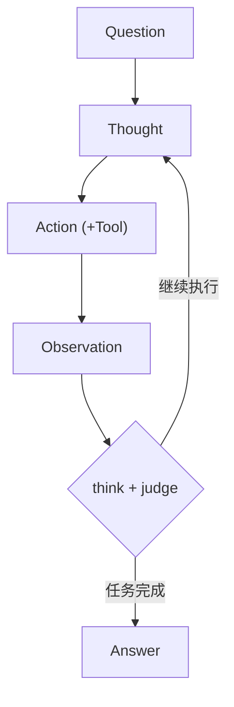

# Agent的演变
**agent**这个概念并不算新。然而，自从LLM被应用于agent后，它的能力得到显著提升，并在近一两年成为热门方向

## 雏形期（21-23）
Agent的目标根据用户的输入，反复执行命令直到判断完成任务。根据这种模式，可以设计出最简单的ReAct型agent。
下面这个agent包含：system prompt、response、user prompt，根据response执行命令、修改文件，根据执行结果更新response。
```python
#基于 https://github.com/dave1010/hubcap 极简agent的python实现
import subprocess
import sys
import time

SYSTEM_PROMPT = """\
you are a coding agent. you can read and write files. Eg `cat helloworld.txt`, `echo "hello\nworld" > helloworld.txt`
output the next command required to progress your goal. output `DONE` when done."""

def chat(prompt: str, system: str | None = None) -> str:
    """Send a message to the LLM via the `llm` CLI tool."""
    options = ["-s", system] if system else ["-c"]
    print(f"\n\033[0;36m[PROMPT]\033[0m {prompt}")
    
    result = subprocess.run(
        ["llm", *options, prompt],
        capture_output=True,
        text=True
    )
    response = result.stdout.strip()
    print(f"\033[1;33m[RESPONSE]\033[0m {response}\n")
    return response


def run_command(cmd: str) -> tuple[int, str]:
    """Execute a shell command and return (return_code, output)."""
    result = subprocess.run(
        cmd,
        shell=True,
        capture_output=True,
        text=True
    )
    return result.returncode, result.stdout + result.stderr


def main():
    if len(sys.argv) < 2:
        print("Usage: python hubcap.py <goal>")
        sys.exit(1)

    goal = sys.argv[1]
    
    # Initial planning
    chat(f"GOAL: {goal}\n\nWHAT IS YOUR OVERALL PLAN?", SYSTEM_PROMPT)

    # Main loop: think → act → observe
    while True:
        response = chat(
            "SHELL COMMAND TO EXECUTE OR `DONE`. NO ADDITIONAL CONTEXT OR EXPLANATION:"
        ).strip()
        
        if response == "DONE":
            break

        print(f"\033[0;32m[EXECUTING]\033[0m {response}")
        time.sleep(3)  # Safety delay - allows user to Ctrl+C
        
        return_code, output = run_command(response)
        chat(
            f"COMMAND COMPLETED WITH RETURN CODE: {return_code}. OUTPUT:\n{output}\n\n"
            "WHAT ARE YOUR OBSERVATIONS?"
        )
```
这段时期的模型并不是很强，如何通过提示词工程(Prompt Engineering)减少模型幻觉、提升模型能力成了大多数人的关注点。这其中衍生出了角色设定（Profiling）技术，通过定义模型扮演的角色来约束其行为风格、提升任务表现
早期的agent几乎没有工具调用能力，现在的tool、mcp、skill全都没有，也缺乏系统性的工具学习框架。agent能力几乎完全取决于模型能力

雏形期的核心价值在于验证了"LLM+模块"范式的可行性，为后续Agent的"软件化"（机制工程）和"社会化"（多智能体）奠定了基础。
自23年底，出现了能**主动调用工具**的agent，扩展了模型的能力
此时的agent处理任务的流程大致如下：

如果将调用工具的自然语言描述使用json格式规范，那么就可以称作function calling技术了
## 爆发期（24-26）
这段时期的agent主要向着大规模、多模态、多智能体协作系统、物理执行方向发展。记忆系统逐渐成熟（短时记忆+长时向量检索+经验抽象），模型调用工具的能力从简单的function calling演化为系统化的tool-use框架。MCP协议作为通用工具调用标准迅速普及，skill技术涌现，上下文工程（prompt压缩、检索增强、上下文窗口管理等）成为关键研究方向。
如果对MCP协议、上下文工程等词还有疑问，可以看看[上期分享会的文章](/posts/15th_meeting/)
- **自主软件工程 Agent**：以Devin、SWE-agent为代表，能独立完成需求分析、代码编写、测试调试和部署上线的全流程软件开发任务，在SWE-bench等基准上持续突破。

- **具身智能 Agent**：将LLM接入机器人、无人机等物理实体，实现自然语言指令到物理动作的端到端映射，在操控、导航、抓取等真实世界任务中展现泛化能力。

- **多模态/全模态 Agent**：不再局限于文本，而是整合视觉、语音、视频、代码等多模态输入输出，模型统一表征各类信息，实现跨模态理解和生成。

- **多智能体协作系统**：多个agent各司其职（如项目经理、架构师、程序员、测试员），通过辩论、投票、分工协作完成复杂任务，群体智能显著超越单agent能力上限。

- **计算机操作 Agent**：直接操控鼠标键盘和图形界面（GUI Agent），模拟人类操作电脑的方式完成任务——打开浏览器、填写表单、操作办公软件，实现端到端桌面自动化。

- **端侧/个人智能体**：模型经量化压缩部署至手机、PC等本地设备，结合用户个人数据形成私有化智能助手，兼顾隐私保护与实时响应，推动AI从云端走向个人。

## 总结
| 方向 | 阶段 | 时间 | 主要特征 |
|------|------|------|------------------|
| **记忆** | 统一短期记忆 | 2021-2022 | 上下文直写，受限于窗口长度 |
| | 混合记忆架构 | 2023 | 短长时分离，向量检索+反思机制 |
| | 经验抽象记忆 | 2024-2025 | 跨轨迹抽象，主动收集高层次策略 |
| | 自我进化记忆 | 2026 | 多模态融合，分布式共享与自主优化 |
| **规划** | 单路径无反馈 | 2021-2022 | 线性CoT推理，无环境反馈修正 |
| | 多路径+反馈 | 2023 | 树状搜索+环境/人类/模型三重反馈 |
| | 自主战略规划 | 2024-2025 | 零样本长程规划，支持多步目标追踪 |
| | 多模态自适应 | 2026 | 视觉-语言-动作一体化，实时动态调整 |
| **行动** | 内部知识驱动 | 2021-2022 | 依赖LLM参数知识，行动空间有限 |
| | 工具调用扩展 | 2023 | API/数据库/外部模型，行动空间扩展 |
| | GUI直接控制 | 2024-2025 | 鼠标键盘操作，端到端任务自动化 |
| | 具身物理执行 | 2026 | 机器人控制，真实环境多模态交互 |
| **协作** | 单Agent独立 | 2021-2022 | 无多智能体交互，角色定义简单 |
| | 角色对话协作 | 2023 | 多角色profile，初步对话分工 |
| | 框架化多智能体 | 2024-2025 | 标准化协议，分布式协作+共享记忆 |
| | 组织化群体智能 | 2026 | 隐性协作，共识记忆，社会化经验进化 |

# 自制Agent任务分享
上一次分享会结束后，我们要求大家使用 Python 和 OpenAI Agents SDK制作一个简单的 Agent。
这个Agent应该能够响应system prompt、能够根据需求调用Tool、修改本地文件。

Show time！👏👏

# 年度总结
本学年论文复现组一共召开了17次分享会，涵盖机器学习、深度学习、强化学习、计算机视觉、NLP、多模态及Agent等多个AI方向。
最长的一篇分享会文章是[强化学习](/posts/11th_meeting_RL/)，达到了两万字，干货满满
分享会文章及其主要内容已梳理到下方的思维导图中，各位可以进行速查👇

```html
/data/posts/img/16/annual-share-mindmap.html
```

做几道题巩固一下？o(*￣▽￣*)ブ

# 尾声
至此，本学年论文复现组的分享会就结束了。
这一年的分享覆盖了多个方向，科普了VGG、ResNet、Transformer等深度学习模型，以及YOLO、SAM等经典计算机视觉模型。或许有的朋友还进行了复现/工程实践。
无论如何，希望各位都能从这些分享中有所收获。[]~(￣▽￣)~*


