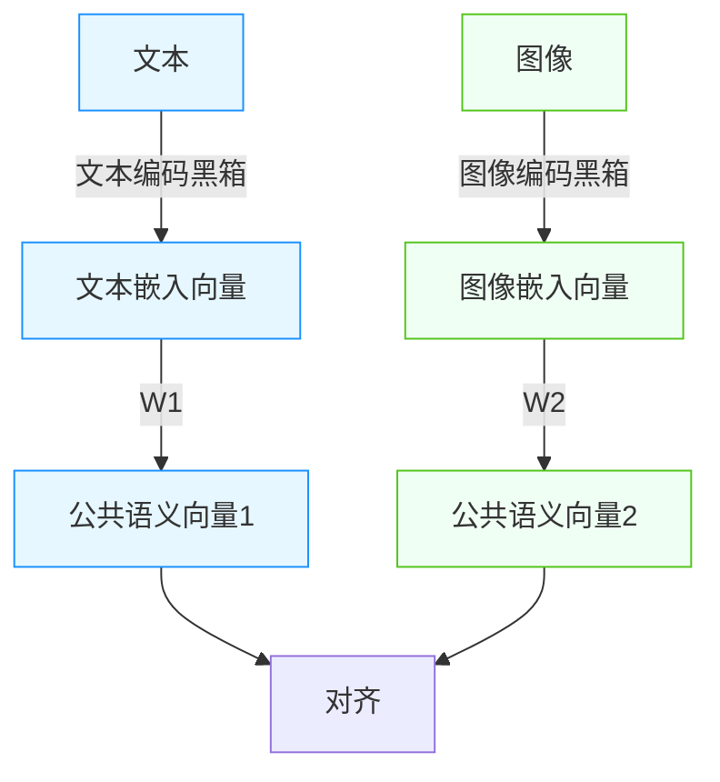

# Markdown渲染器使用说明

## 📖 概述

本Markdown渲染器是一个通用的文档展示工具,可以用于展示各类Markdown格式的内容,包括:
- 📝 例会回顾
- 📚 学习笔记
- 📋 作业题目
- 📄 技术文档
- 💡 其他任何Markdown内容

## 🚀 使用方法

### 1. 添加Markdown文件

将你的 `.md` 文件放入 `data/` 目录下,例如:
- `data/例会回顾.md`
- `data/Python测试题.md`
- `data/学习笔记.md`

### 2. 创建链接

在主页或其他地方添加链接,格式为:
```html
<a href="markdown-viewer.html?file=文件名(不含.md扩展名)" target="_blank">查看详细</a>
```

**示例**:
```html
<!-- 链接到 data/Python测试题.md -->
<a href="markdown-viewer.html?file=Python测试题">查看详细</a>

<!-- 链接到 data/论文复现组——Python测试题.md -->
<a href="markdown-viewer.html?file=论文复现组——Python测试题">查看详细</a>
```

## ✨ 支持的Markdown特性

### 基本语法

1. **标题**: `# H1` `## H2` `### H3` 等
2. **强调**: `**粗体**` `*斜体*`
3. **列表**: 
   - 无序列表: `- 项目`
   - 有序列表: `1. 项目`
   - 任务列表: `- [ ] 未完成` `- [x] 已完成`
4. **链接**: `[文本](URL)`
5. **图片**: ``
6. **引用**: `> 引用内容`
7. **分割线**: `---` 或 `***`

### 代码支持

**行内代码**:
```markdown
使用 `变量名` 来引用代码
```

**代码块**(支持语法高亮):
````markdown
```python
def hello():
    print("Hello, World!")
```

```javascript
console.log("Hello, World!");
```
````

支持的语言包括: Python, JavaScript, Java, C++, HTML, CSS, JSON, Markdown 等

### 数学公式

支持 LaTeX 数学公式渲染(使用KaTeX):

**行内公式**: 使用 `$...$`
```markdown
这是行内公式: $E = mc^2$
```

**块级公式**: 使用 `$$...$$`
```markdown
$$
S = \frac{v\eta C}{P + mv + nv^2}
$$
```

### 表格

支持GFM(GitHub Flavored Markdown)表格:
```markdown
| 列1 | 列2 | 列3 |
|-----|-----|-----|
| 值1 | 值2 | 值3 |
| 值4 | 值5 | 值6 |
```

**移动端优化**: 表格支持横向滚动

### MERMAID
支持渲染MERMAID图 ：
示例：


### Bilibili视频
现在可以在markdown文件中写入Bilibili视频，方便引入视频
可以在bilibili网页分享中获取代码嵌入，然后将src写入markdown文件中，就可以自动插入bilibili视频
示例：
```video
//player.bilibili.com/player.html?isOutside=true&aid=114293995476145&bvid=BV1VvRkYHEqz&cid=29275194323&p=1
```


## 🎨 样式效果

渲染后的样式包括:
- **H1标题**: 渐变色(青→粉→紫),带下划线
- **H2标题**: 青色,左侧竖线装饰
- **H3标题**: 紫色
- **H4标题**: 粉色
- **代码块**: 暗色背景,语法高亮
- **引用**: 粉色左边框,半透明背景
- **表格**: 青色表头,悬停高亮
- **链接**: 青色文字,悬停变粉色
- **数学公式**: KaTeX渲染,美观清晰

## 📱 响应式支持

完全支持移动端访问:
- 自适应字体大小
- 表格横向滚动
- 代码块横向滚动
- 优化的触摸体验

## 🐛 常见问题

### Q1: 文件找不到怎么办?
**A**: 检查以下几点:
1. 文件是否放在 `data/` 目录下
2. 文件名是否正确(区分大小写)
3. URL中的文件名不要包含 `.md` 扩展名

### Q2: 数学公式不显示?
**A**: 
- 确保使用正确的语法: `$...$` 或 `$$...$$`
- 检查网络连接,KaTeX库是否正常加载
- 刷新页面重试

### Q3: 代码高亮不工作?
**A**:
- 确保代码块指定了语言(如 ```python)
- 检查highlight.js库是否正常加载
- 系统会自动尝试备用CDN

### Q4: 图片不显示?
**A**:
- 使用相对路径: ``
- 或使用完整URL: ``
- 确保图片文件存在且路径正确

## 📂 文件命名规范

建议的命名方式:
- ✅ 使用中文: `例会回顾.md`
- ✅ 使用连字符: `python-test-questions.md`
- ✅ 使用下划线: `python_test_questions.md`
- ❌ 避免空格: `python test questions.md` (可能导致URL问题)
- ❌ 避免特殊字符: `python@test#questions.md`

## 🔧 技术栈

- **Markdown解析**: [marked.js](https://marked.js.org/)
- **代码高亮**: [highlight.js](https://highlightjs.org/)
- **数学公式**: [KaTeX](https://katex.org/)
- **样式**: 自定义CSS,科技炫酷风格

## 💡 最佳实践

1. **文件组织**: 按类别组织文件
   ```
   data/
   ├── 例会/
   │   ├── 2024-10-18-成立大会.md
   │   └── 2024-10-19-第一次分享会.md
   ├── 作业/
   │   └── Python测试题.md
   └── 笔记/
       └── 深度学习入门.md
   ```

2. **标题层级**: 合理使用标题层级,便于阅读
   - H1: 文档标题(每个文档只用一次)
   - H2: 主要章节
   - H3: 子章节
   - H4: 小节

3. **代码示例**: 为代码块指定语言以获得高亮
   ````markdown
   ```python
   # 这样会有语法高亮
   ```
   ````

4. **图片优化**: 
   - 使用合适的图片大小
   - 提供有意义的alt文本
   - 考虑使用CDN加速

## 🎯 示例文档

参考已有的文档:
- `智能基座成立大会.md` - 基础示例
- `技术部第一次分享会.md` - 代码块示例
- `论文复现组——Python测试题.md` - 数学公式和表格示例

## 📞 需要帮助?

如有问题,请联系:
- 邮件: ethan@stu2024.jnu.edu.cn
- 微信: _Fish890

